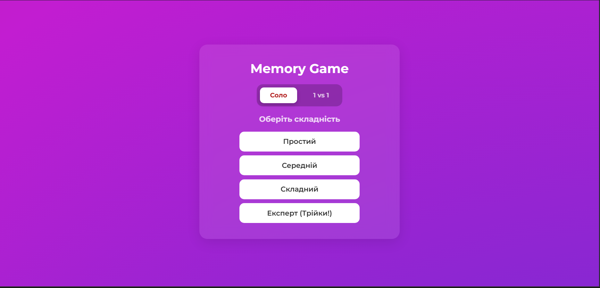
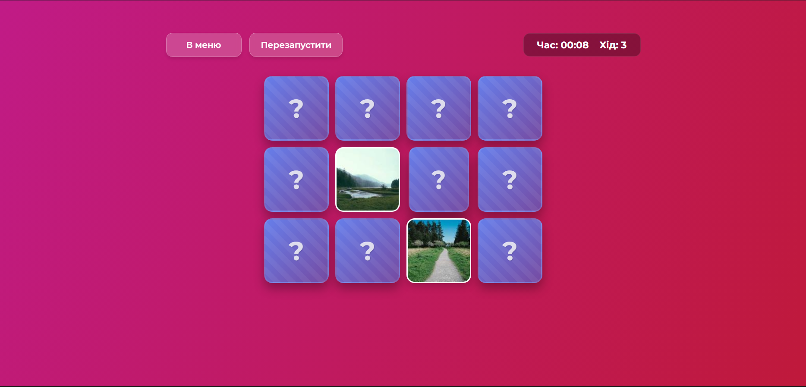
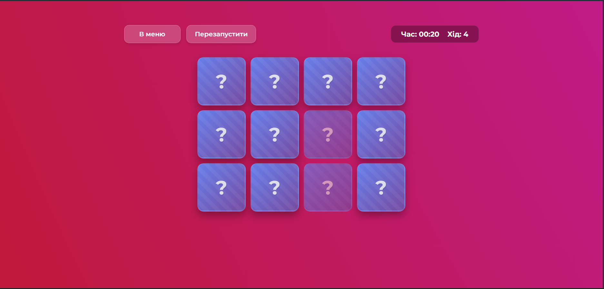

# 🧠 Memory Game (Гра "Знайди пару")

Це класична інтерактивна гра для тренування пам'яті, розроблена з використанням фреймворку **Angular**.
Мета гри — знайти всі пари однакових карток за найменшу кількість ходів та часу.

## Скріншоти

### Меню гри



### Вигляд під час ігрового процесу



### Вигляд після обирання правильної пари



## Функціонал

- **Інтерактивний геймплей:** Плавна анімація перевертання карток.
- **Таймер та лічильник ходів:** Допомагає відстежувати прогрес.
- **Адаптивність:** Гра коректно відображається на комп'ютерах та мобільних пристроях.
- **Перезапуск:** Можливість почати гру заново без перезавантаження сторінки.
- **Звукові ефекти:** Звуки при кліку та перемозі.

## Технології

Проєкт створено за допомогою:

- Angular CLI
- HTML5 / SCSS
- TypeScript

## Як запустити проєкт локально

Щоб запустити цей проєкт на своєму комп'ютері, виконайте наступні кроки:

1. **Клонуйте репозиторій:**
   ```
   git clone https://github.com/Alex-965/memory_game.git
   ```
   **Перейдіть у папку проєкту:**
    ```
    cd memory-game
    ```
   **Встановіть залежності (npm packages):**
    ```
   npm install
    ```
   **Запустіть локальний сервер:**
    ```
   ng serve
    ```
   **Відкрийте браузер та перейдіть за посиланням**
    ```
    http://localhost:4200/.
    ```

## Як грати
Натисніть на будь-яку картку, щоб перевернути її.

Спробуйте знайти картку з таким самим зображенням.

Якщо зображення збігаються — картки стануть неактивними.

Якщо ні — вони перевертаються назад.

Гра закінчується, коли всі пари знайдено!

## Проєкт виконали:
Студенти групи ІПЗ-31:

**Stepan Zanyk**
GitHub: ZanykStepan

**Olexandr Kobzei**
GitHub: Alex-965
